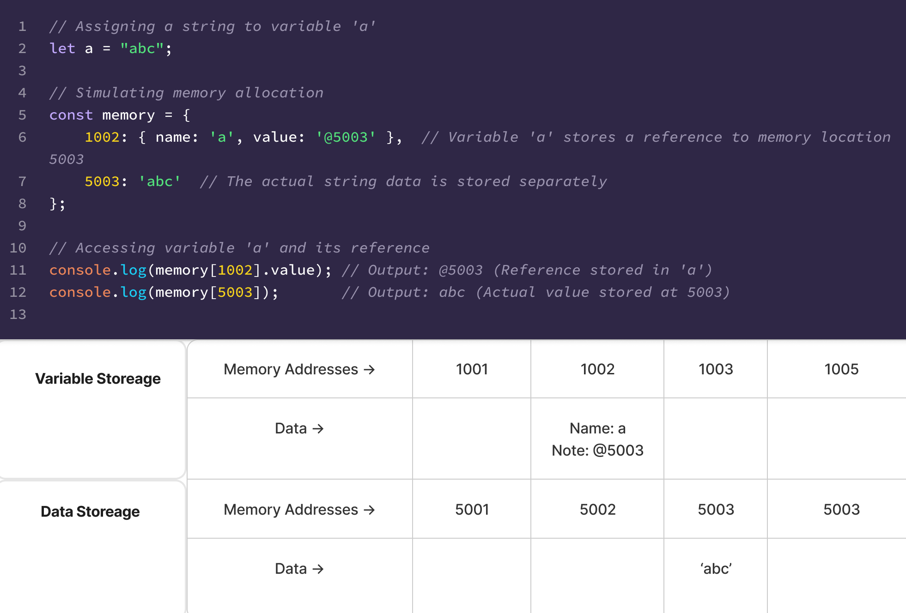

# JavaScript Data Types & Memory Management

## 01. Data Types in JavaScript

### Types of Data
JavaScript data types are broadly classified into two categories:

#### 1. Primitive Types
- `Number` – Numeric values
- `String` – Text values
- `Boolean` – `true` or `false`
- `null` – Represents an intentional absence of value
- `undefined` – Represents an uninitialized variable
- `Symbol` – Unique identifiers (introduced in ES6)

#### 2. Reference Types
- `Object` – Key-value pairs
- `Array` – Ordered collection of values
- `Function` – Blocks of reusable code
- `Date` – Date and time representations
- `RegExp` – Regular expressions
- `Map` – Key-value pairs with any type of key (ES6)
- `WeakMap` – Similar to Map but keys are weakly referenced (ES6)
- `Set` – Collection of unique values (ES6)
- `WeakSet` – Similar to Set but values are weakly referenced (ES6)

### Primitive vs. Reference Types
- **Primitive types**: Directly store values in memory.
- **Reference types**: Store references (memory addresses) pointing to objects in memory.

---

## 02. Identifiers and Variables

### Definition
- **Variable**: A container for storing data that can change.
- **Identifier**: A name used to identify variables.

---

## 03. Variable Declaration & Data Assignment

### Variable Declaration
```js
var a;
```
This means:
> "Create a variable `a` that can hold data."

A variable acts as a **container** or **storage space** for data.

### Data Assignment
```js
var a; // Declaring a variable
a = "abc"; // Assigning a string value to 'a'
```
However, **the actual value is not stored directly in the variable's memory location**.



### Memory Allocation Process
1. The system finds an empty space in the **variable memory region** (e.g., `@1002`).
2. It assigns the identifier `a` to that memory address.
3. A separate **data memory region** is allocated (e.g., `@5003`) to store `"abc"`.
4. The system links `a` (`@1002`) to the memory address of `"abc"` (`@5003`).
5. Now, accessing `a` retrieves the value stored at `@5003`.

---

## 04. Primitive vs. Reference Data

### **Immutable Values (Primitive Types)**
A value is **immutable** if it cannot be changed once created.

#### Example:
```js
var a = "abc";
a = a + "def";
```
- `"abc"` remains unchanged.
- A **new string** `"abcdef"` is created and stored at a different memory location.
- `a` now references the new memory location.

---

### **Mutable Values (Reference Types)**
Unlike primitive types, **reference types (objects, arrays, functions, etc.) are mutable**.

#### Example:
```js
var obj1 = { a: 1, b: "bbb" };
obj1.a = 2;
```
- `obj1` continues to point to the same memory location.
- Only the **internal property values** (`a: 1 → a: 2`) are updated.

---

## 05. Variable Copying: Primitive vs. Reference Types

### **Primitive Data Copying**
```js
var a = 10;
var b = a;
b = 15;
```
- `b` gets a **copy** of `a`'s value.
- Changing `b` does not affect `a`.

### **Reference Data Copying**
```js
var obj1 = { c: 10, d: "ddd" };
var obj2 = obj1;
obj2.c = 20;
```
- `obj2` does not get a **copy** of `obj1`; it gets a **reference**.
- Changing `obj2.c` affects `obj1.c` because they point to the same memory location.

---

## 06. Immutable Objects
### **Why Use Immutable Objects?**
- **Prevents accidental modifications**.
- **Ensures data consistency**.
- **Avoids side effects in functions**.

### **Copying Objects for Immutability**
To make an object immutable, create a new object instead of modifying the existing one.

#### **Shallow Copy (One-Level Copy)**
```js
var copyObject = function (target) {
    var result = {};
    for (var prop in target) {
        result[prop] = target[prop];
    }
    return result;
};
```
- Only **copies the first-level properties**.
- **Nested objects are still referenced**, meaning changes in the copy affect the original.

#### **Deep Copy (Full Object Copy)**
```js
var deepCopyObject = function (target) {
    var result = {};
    if (typeof target === "object" && target !== null) {
        for (var prop in target) {
            result[prop] = deepCopyObject(target[prop]); // Recursive copy
        }
    } else {
        result = target;
    }
    return result;
};
```
- **Copies all nested objects**.
- Prevents unintended modifications to the original object.

---

## 07. `undefined` vs. `null`
### **When Does JavaScript Assign `undefined`?**
- Accessing a **declared but uninitialized variable**.
- Accessing **non-existent object properties**.
- Functions that do not explicitly return a value.

#### **Example**
```js
var a;
console.log(a); // undefined

var obj = {};
console.log(obj.nonExistentProp); // undefined
```

### **Using `null`**
- Explicitly represents an **empty or unknown value**.
- Unlike `undefined`, **`null` is a value assigned intentionally**.

#### **Example**
```js
var n = null;
console.log(typeof n); // "object"
console.log(n == undefined); // true (loose equality)
console.log(n === undefined); // false (strict equality)
```

---

## 08. Quiz
What will be the output of the following?
```js
var person = {
    name: "jiwon",
    like: { food: "pasta" }
};
var copyPerson = { ...person };

console.log(person === copyPerson);        // ?
console.log(person.like === copyPerson.like); // ?
console.log(person.like.food === copyPerson.like.food); // ?
```
> **Think about how spread operators handle object copying.**

---
